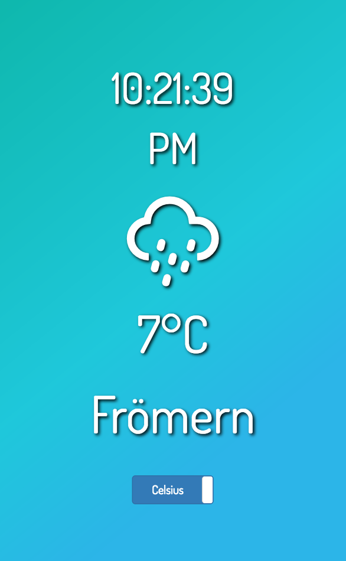

# freeCodeCamp Local Weather App

This is my personal implementation of the freeCodeCamp Local Weather Intermediate challenge.

You can access the app in its current state at:
https://alaskaa.github.io/fcc-weather-app

The app can be accessed on desktop or mobile without any problems.

This repository is still being updated and cleaned up.
